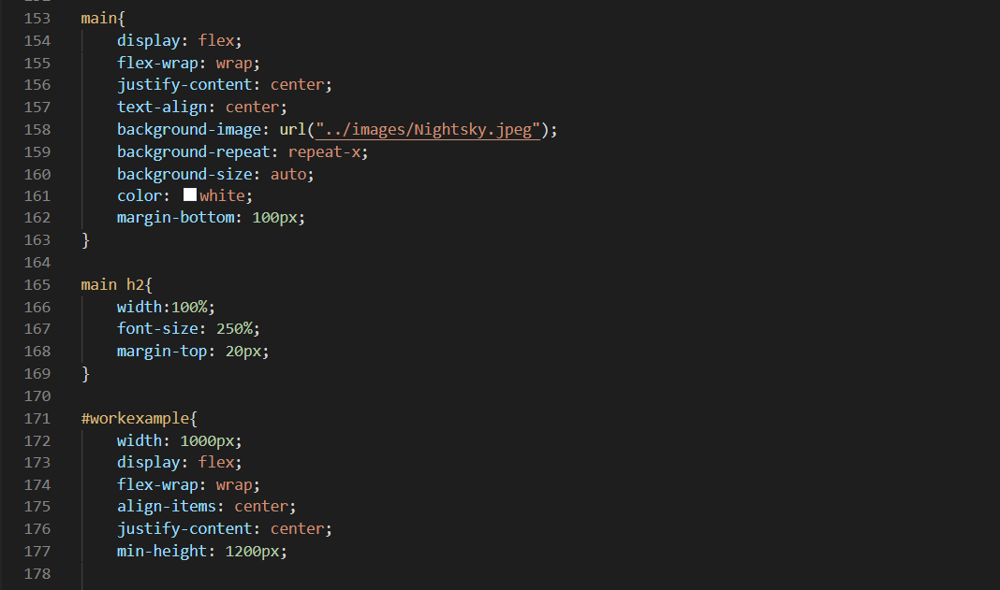
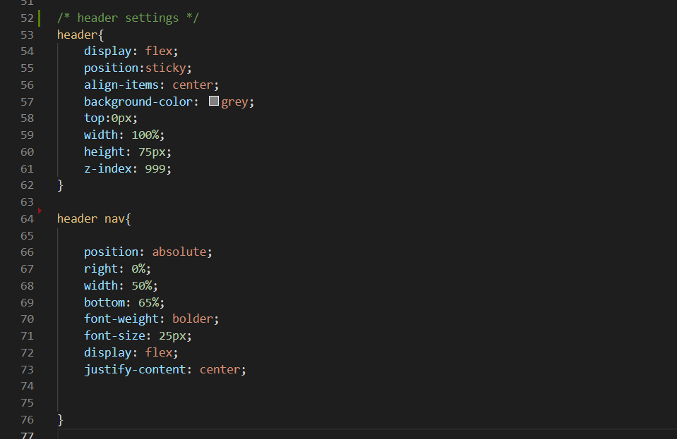
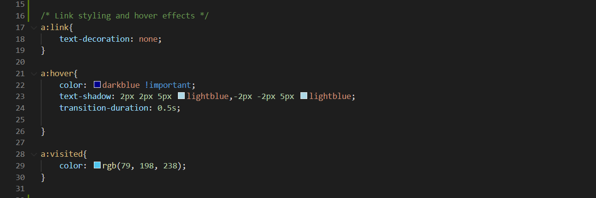

# Personal Portfolio

This is my personal portfolio that presents basic personal information, work samples and contacts.
​
## Getting Started
​
To open the deployed site, click [here](https://tonyzyt9947.github.io/PersonalPortfolio/).

To view the html code, open index.html.

To view the css code, open assets/css/style.css.
​
 

### Prerequisites
​
The site should be able to run on any web browser.
 
### Installing

Click [here](https://www.google.com/chrome/) to install google chrome to open the site.

 

## Built With

* [HTML](https://developer.mozilla.org/en-US/docs/Web/HTML)
* [CSS](https://developer.mozilla.org/en-US/docs/Web/CSS)
  
## Deployed Link

* [See Live Site](https://tonyzyt9947.github.io/PersonalPortfolio/)
​
​  
## Feature Implementation Code Examples

1. Uses flexbox to align items at center on both axes (lines 154-157, 173-176) and wrap items around given limited space (lines 155,174)

2. Uses sticky position to stick header on top of screen when scroll past hero image (line 55), then uses absolute positioning anchoring on a relative or sticky positioned object to position the navigation bar (line 66).

3. Uses pseudo-class effects on links, setting conditions when hovered (lines 21-26) and visited (lines 28-30).

4. Adds responsive display options for smaller screen size by "media screen" command for various site elements (all lines).

## Authors

* **Tony Zhang** 
- [Link to Portfolio Site](https://tonyzyt9947.github.io/PersonalPortfolio/)
- [Link to Github](https://github.com/Tonyzyt9947)
- [Link to LinkedIn](https://www.linkedin.com/in/tony-zhang-61670421b/)
​
  

## License
​
This project is licensed under the MIT License 
​
  
## Acknowledgments
* Social media icons. [Link](https://www.flaticon.com/authors/pixel-perfect)
* Lighthouse chrome extension. [Link](https://developers.google.com/web/tools/lighthouse)
